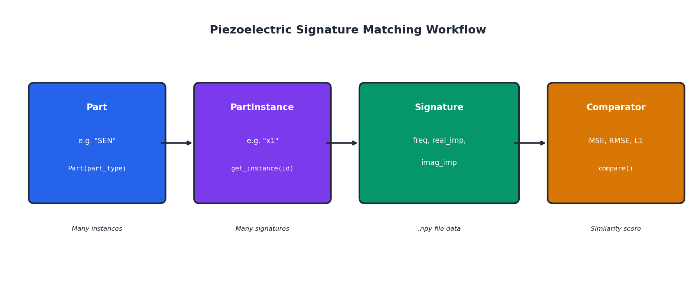
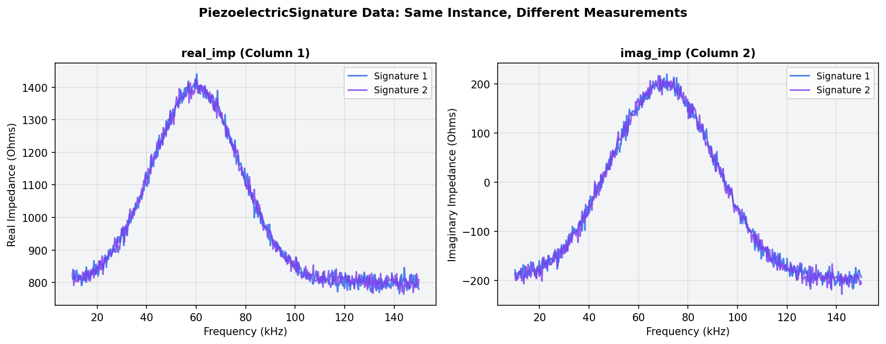
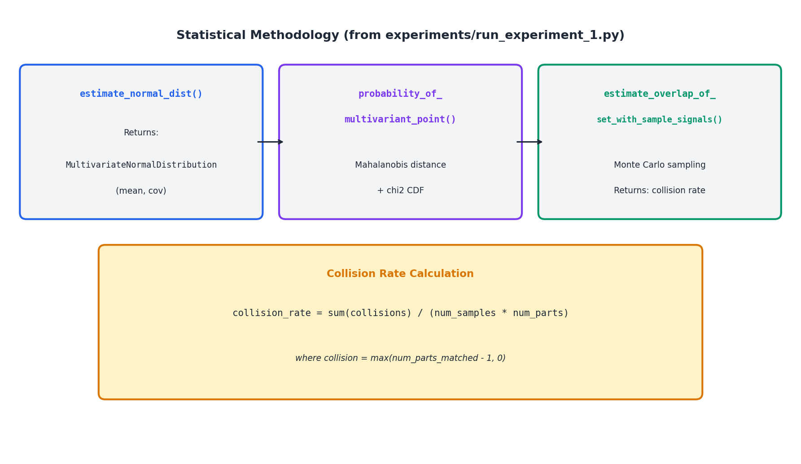
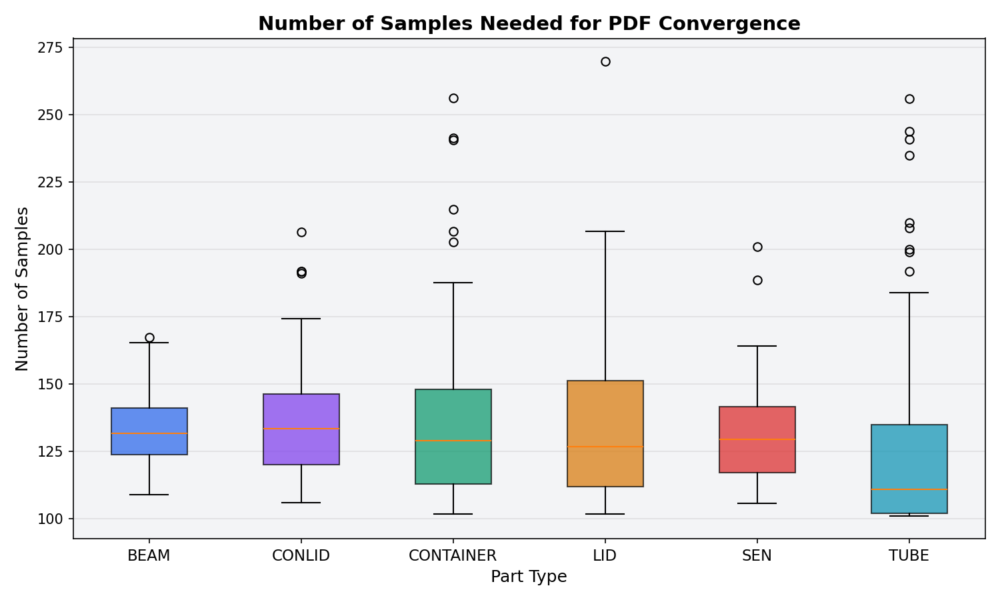

<div align="center">

# 🔬 Piezoelectric Signature Matcher

**Counterfeit Detection via Impedance Signature Analysis**

*A probabilistic framework for uniquely identifying manufactured parts using piezoelectric impedance signatures*

*Henry Gilbert, Ruida Zeng, Michael Sandborn, Jules White, Douglas C. Schmidt*

*Department of Computer Science, Vanderbilt University*

<a href='docs/Cyber_Physical_Component_Verification_with_Global_Collision_Estimation_Through_Markov_Integration.pdf'></a>
<a href='https://www.python.org/downloads/'></a>
<a href='LICENSE'></a>

[**Overview**](#overview) | [**Installation**](#installation) | [**Quick Start**](#quick-start) | [**Methodology**](#methodology) | [**Experiments**](#experiments) | [**Citation**](#citation) | [**License**](#license)

</div>

---

## Overview

**Piezoelectric Signature Matcher** (`psig-matcher`) provides a framework for comparing impedance signature measurements to determine similarity for **counterfeit detection**. The goal is to identify a unique representation of impedance signature data that is:

- ✅ **Tolerant to measurement noise** — Handles environmental variations
- ✅ **Uniquely identifying** — Distinguishes between individual specimens  
- ✅ **Probabilistically rigorous** — Provides quantifiable confidence bounds

<p align="center">
  
</p>

> [!NOTE]
> This repository accompanies our paper: *"Cyber-Physical Component Verification with Global Collision Estimation Through Markov Integration"*. The full paper is available in the [`docs/`](docs/) folder. It is a research prototype demonstrating piezoelectric signature matching for anti-counterfeiting applications.

---

## The Problem

Counterfeiting creates a **cyber-physical information assurance problem** in cyber-physical systems (CPSs). According to the Global Brand Counterfeiting report, aggregated losses caused by counterfeiting are estimated to exceed **$1.82 Trillion USD**. More critically, counterfeit parts infiltrating mission-critical systems such as flight controllers pose tangible physical risks to society.

Traditional verification methods fall short of creating provable connections to tie digital information (e.g., database entries) to physical part instances. Thus, a counterfeit part will always have a non-zero probability of being consumed undetected with traditional methods.

---

## How It Works

### The Core Idea

The fundamental approach involves attaching **piezoelectric transducers** to rigid physical parts and measuring the part's electromechanical response to an induced vibration over a range of frequencies. This creates an **impedance identity** that uniquely identifies the part.

Key properties of piezoelectric signatures:

1. **Physically Unclonable**: There are currently no known ways to manufacture a part with a *desired* impedance identity
2. **Tamper-Evident**: If the sensor is removed or tampered with, the signature is destroyed
3. **Quality-Linked**: Lower-quality counterfeits inherently create different signatures, forcing counterfeiters to manufacture at the same quality as legitimate producers

By modeling these signatures as **multivariate probability distributions**, we can:

1. **Register** authentic parts by measuring their signatures multiple times
2. **Classify** new measurements against registered part distributions
3. **Detect** counterfeits when signatures don't match any known distribution
4. **Estimate** the global collision rate using Markov Integration

<p align="center">
  
</p>

### Data Structure

Each signature measurement contains three components:

| Component | Description | Typical Range |
|-----------|-------------|---------------|
| **Frequency** | Excitation frequency (Hz) | 10 kHz – 150 kHz |
| **Real Impedance (Z)** | Resistive component (Ω) | Varies by part |
| **Imaginary Impedance (X)** | Reactive component (Ω) | Varies by part |

---

## Architecture

```
                              psig-matcher
  ╔═══════════════════════════════════════════════════════════════════════╗
  ║                                                                       ║
  ║   ┌─────────────┐      ┌─────────────────┐      ┌─────────────────┐   ║
  ║   │    Part     │ ───► │  PartInstance   │ ───► │  Piezoelectric  │   ║
  ║   │  (e.g. SEN) │      │   (e.g. x1)     │      │    Signature    │   ║
  ║   └──────┬──────┘      └────────┬────────┘      └────────┬────────┘   ║
  ║          │                      │                        │            ║
  ║          ▼                      ▼                        ▼            ║
  ║   ┌─────────────┐      ┌─────────────────┐      ┌─────────────────┐   ║
  ║   │  Multiple   │      │    Multiple     │      │  freq[], Z[],   │   ║
  ║   │  Instances  │      │   Signatures    │      │      X[]        │   ║
  ║   └─────────────┘      └─────────────────┘      └─────────────────┘   ║
  ║                                                                       ║
  ╠═══════════════════════════════════════════════════════════════════════╣
  ║                           Comparator                                  ║
  ║                    MSE  •  RMSE  •  L1 Distance                       ║
  ╚═══════════════════════════════════════════════════════════════════════╝
```

### Class Hierarchy

| Class | Description |
|-------|-------------|
| `Part` | Collection of all instances of a part type (e.g., all "Sensors") |
| `PartInstance` | Single physical specimen with multiple signature measurements |
| `PiezoelectricSignature` | One measurement: frequency, real impedance, imaginary impedance |
| `Comparator` | Computes similarity metrics between two signatures |

---

## Installation

### Prerequisites

- Python 3.6+
- pip package manager

### Setup

```bash
# Clone the repository
git clone https://github.com/yourusername/matcher.git
cd matcher

# Create and activate virtual environment (recommended)
python -m venv venv
source venv/bin/activate  # On Windows: venv\Scripts\activate

# Install in development mode
pip install -e .
```

### Dependencies

Core dependencies are automatically installed:

```
numpy>=1.23.0
pandas>=1.5.0
scipy>=1.9.0
scikit-learn>=1.1.0
matplotlib>=3.6.0
plotly>=5.10.0
perlin-noise>=1.12
```

For experiment tracking:
```bash
pip install mlflow
```

---

## Quick Start

### Basic Usage

```python
from psig_matcher.utils import Part, Comparator

# Load all instances of a part type
sensor = Part("SEN")

# List available instances
sensor.list_instances()
# Output: instance names for part type SEN: ['x1', 'x2', ...]

# Get a specific instance
sen_x1 = sensor.get_instance("x1")

# List all signatures for this instance
sen_x1.list_signatures()
# Output: signature list for SEN instance x1: dict_keys(['sen_x1_1', 'sen_x1_2', ...])

# Get specific signatures
sig1 = sen_x1.get_signature("1")
sig2 = sen_x1.get_signature("2")

# View signature summary
print(sig1)
```

**Output:**
```
 ++ Summary of SEN instance x1 ++
file: psig_matcher/data/SEN/x1/sen_x1_1.npy
min freq: 10000.0
max freq: 150000.0
size: 500
normalized mean: 0.423
normalized std: 0.187
++++++++++++++++++++++++++++++++++
```

### Comparing Signatures

```python
# Compare two signatures from the same instance
comparator = Comparator(sig1, sig2)
comparator.compare()
```

**Output:**
```
comparing SEN_x1 with SEN_x1
comparison metrics: {'mse': 1234.56, 'rmse': 35.14, 'l1': 28.92}
```

### Generating Synthetic Data

```python
# Generate noisy synthetic signatures using Perlin noise
noise_stats = sig1.generate_synthetic(n=50, plot=True)
print(f"Generated 50 synthetic signatures with avg μ={noise_stats[0]:.4f}, σ={noise_stats[1]:.4f}")
```

---

## Methodology

### Statistical Framework

The system uses a **probabilistic approach** based on **Markov Integration** to model signature uncertainty and estimate collision rates:

<p align="center">
  
</p>

#### 1. Part PDF Estimation

Each part's signal variations are modeled as a **multivariate normal distribution**:

```python
# Signals modeled as N(μ, Σ) where:
# μ = mean signal vector (500 dimensions for full frequency range)
# Σ = covariance matrix capturing signal variability
```

- Uses **t-distribution** for small sample sizes (n < 30) per statistical best practices
- Uses **normal distribution** for larger samples (Central Limit Theorem)
- Confidence intervals scale the estimated standard deviation

#### 2. Collision Rate Estimation via Markov Integration

The **collision rate** is defined as the probability that any two parts of the same type generate signals that correspond to more than one part instance. This represents the **global security** of a given part type.

```
┌──────────────────────────────────────────────────────────────────┐
│                    Monte Carlo Sampling                          │
├──────────────────────────────────────────────────────────────────┤
│  1. Create meta-PDF from all signals of a part type              │
│  2. Draw N random samples from meta-PDF                          │
│  3. For each sample, compute P(sample | part_i) for all parts    │
│  4. Count "collisions" where sample matches multiple parts       │
│  5. Collision Rate = collisions / (N × num_parts)                │
└──────────────────────────────────────────────────────────────────┘
```

**Key insight from the paper**: The collision rate upper bound is **most commonly estimated at 0**, meaning counterfeits cannot increase collision rates above this bound even with perfect knowledge of part specifications.

#### 3. Convergence Detection

The algorithm automatically determines when enough samples have been collected:

```python
# Convergence criterion:
# Stop when mean(CI[-10:]) >= mean(CI[-100:])
# i.e., confidence interval stops shrinking
```

### Hyperparameters

The methodology is parameterized on a set of hyperparameters that allow explicit control over the trade-off between false negative rates and system security:

| Parameter | Description | Effect when ↑ | Effect when ↓ |
|-----------|-------------|---------------|---------------|
| `meta_pdf_ci` | Confidence interval for meta distribution | Wider bounds → Higher collision rate | Tighter bounds → Lower collision rate |
| `part_pdf_ci` | Confidence interval for part distributions | Wider bounds → Higher collision rate | Tighter bounds → Lower collision rate |
| `confidence_bound` | Classification acceptance threshold | Stricter matching → Lower collision rate (but ↑ false negatives) | Looser matching → Higher collision rate |
| `part_dim` | Number of frequency points used | More dimensions → Lower collision rate | Fewer dimensions → Higher collision rate |

### Security Guarantees

The proposed solution's assertions hold even when malicious actors obtain **perfect knowledge** (complete information regarding a part type, including specifications and manufacturing process). Since:

1. A part's geometry cannot be derived from its latent signal representation
2. The counterfeiting process always introduces more variance than the original manufacturing process

A malicious actor is unable to increase the collision rate above the estimated upper bound.

---

## Experiments

### Running Experiments with MLflow

The project includes Jupyter notebooks for running and analyzing experiments:

```bash
# Start MLflow UI (optional, for visualization)
mlflow ui

# Run the main experiment
python psig_matcher/experiments/run_experiment_1.py
```

### Experiment 1: PDF Convergence Analysis

Measures how many signal samples are needed until the confidence interval converges:

<p align="center">
  
</p>

### Interactive Notebooks

| Notebook | Description |
|----------|-------------|
| [`experiment_1.ipynb`](psig_matcher/experiments/experiment_1.ipynb) | Part Signal PDF Convergence |
| [`data_analysis_1.ipynb`](psig_matcher/experiments/data_analysis_1.ipynb) | Results visualization and analysis |
| [`process_validation.ipynb`](psig_matcher/experiments/process_validation.ipynb) | Complete methodology validation |

### Example: Collision Rate Analysis

From `process_validation.ipynb`:

```python
# Base configuration
part_type = 'CONLID'
part_dim = 5
num_samples = 100
meta_pdf_ci = 0.999
part_pdf_ci = 0.999
confidence_bound = 0.999

# Run analysis
con_parts = load_part_data(part_type)
collision_rate = estimate_overlap_of_set_with_sample_signals(
    con_parts, num_samples, confidence_bound
)
print(f"Upper collision rate: {collision_rate * 100:.2f}%")
```

---

## Data Organization

```
psig_matcher/data/
├── BEAM/          # Beam structure measurements
├── BOX/           # Box container measurements
├── BRK/           # Bracket measurements
├── CONLID/        # Container with glued lid measurements
├── CONTAINER/     # Container only measurements
├── FLG/           # Flange measurements
├── IMP/           # Impeller measurements
├── LID/           # Lid only measurements
├── SEN/           # Sensor only measurements
├── TUBE/          # Plastic tube measurements
└── VNT/           # Vent measurements
```

Each `.npy` file contains a NumPy array of shape `(N, 3)`:
- Column 0: `freq` — Frequency (Hz)
- Column 1: `real_imp` — Real impedance (Ω)
- Column 2: `imag_imp` — Imaginary impedance (Ω)

### Adding New Data

1. Place Excel files (`.xls`) or CSV files (`.csv`) in the appropriate part type directory
2. Run the conversion script:

```bash
python psig_matcher/data_conversion.py
```

3. Update `ALL_PART_TYPES` in `__init__.py` if adding a new part type

---

## Project Structure

```
matcher/
├── docs/                     # Paper and documentation
│   └── Cyber_Physical_Component_Verification_with_Global_Collision_Estimation_Through_Markov_Integration.pdf
├── psig_matcher/
│   ├── __init__.py           # Constants and configuration
│   ├── __main__.py           # CLI entry point
│   ├── utils.py              # Core classes (Part, Signature, Comparator)
│   ├── data_conversion.py    # XLS/CSV to NPY converter
│   ├── data/                 # Measurement data by part type
│   └── experiments/
│       ├── utilities.py      # Statistical helper functions
│       ├── run_experiment_1.py
│       ├── experiment_1.ipynb
│       ├── data_analysis_1.ipynb
│       └── process_validation.ipynb
├── graphs/                   # Generated visualizations
├── images/                   # README images and diagrams
├── mlruns/                   # MLflow experiment tracking
├── setup.py                  # Package configuration
├── requirements.txt          # Dependencies
└── README.md
```

---

## Supported Part Types

The following part types are available in the dataset:

| Code | Description |
|------|-------------|
| `BEAM` | Beam structure measurements |
| `BOX` | Box container measurements |
| `BRK` | Bracket measurements |
| `CONLID` | Container with glued lid measurements |
| `CONTAINER` | Container only measurements |
| `FLG` | Flange measurements |
| `IMP` | Impeller measurements |
| `LID` | Lid only measurements |
| `SEN` | Sensor only measurements |
| `TUBE` | Plastic tube measurements |
| `VNT` | Vent measurements |

---

## Limitations

- **Frequency Range Dependency**: Signatures must be measured over compatible frequency ranges for comparison
- **Sample Size**: Accurate PDF estimation requires multiple measurements per part instance
- **Dimensionality**: Full 500-dimension analysis may require substantial sample sizes; dimensionality reduction is often necessary
- **Sensitivity**: Piezoelectric sensors are highly sensitive and dependent on external factors, requiring multiple measurements for reliable classification
- **Research Prototype**: Not production-ready; intended for experimental validation

---

## Future Work

- [ ] Real-time measurement integration
- [ ] Streaming data source support for continuous PDF updates
- [ ] Web interface for signature registration and matching
- [ ] Support for wireless/contactless measurements
- [ ] Database backend for large-scale part registration

---

## License

This project is licensed under the [GNU General Public License v3.0](LICENSE).

---

## Citation

If you use this work in your research, please cite our paper:

> **Cyber-Physical Component Verification with Global Collision Estimation Through Markov Integration**
>
> Henry Gilbert, Ruida Zeng, Michael Sandborn, Jules White, Douglas C. Schmidt
>
> *Department of Computer Science, Vanderbilt University*

```bibtex
@inproceedings{gilbert2023cyberphysical,
  title={Cyber-Physical Component Verification with Global Collision Estimation Through Markov Integration},
  author={Gilbert, Henry and Zeng, Ruida and Sandborn, Michael and White, Jules and Schmidt, Douglas C.},
  booktitle={Proceedings of the IEEE},
  year={2023},
  organization={Vanderbilt University},
  address={Nashville, TN, USA}
}
```

### Abstract

> Asserting the provenance of an item is an essential validation in any supply chain process. Unfortunately, counterfeit objects continue to proliferate as these networks grow in size and complexity. Anything from consumer luxury items to safety-critical subsystem components are targeted by counterfeiters. The reliable assertion of an item's origin and build quality remains an open problem that is expected to cost the global economy trillions of dollars (USD) in coming years. While institutional economic disparity is a concern, poor quality counterfeits infiltrating mission-critical systems, such as flight controllers, pose a tangible and physical risk to society. To address this issue, we propose a novel approach for detecting counterfeit items using piezoelectric signatures which result from actuating piezoelectric sensors and observing the electromechanical response. We demonstrate that the collision rate (percentage of parts that are counterfeit and probability of part type signal overlap) of piezoelectric signatures can be analytically estimated and tuned in relation to desired parameters such as a minimal false positive rate.

---

## Author Contact Information

Feel free to reach out to the authors for further inquiries or collaborations:

| Name | Affiliation | Contact |
|------|-------------|---------|
| **Henry Gilbert** | Vanderbilt University | `henry.gilbert [at] vanderbilt [dot] edu` |
| **Ruida Zeng** | Vanderbilt University | `ruida.zeng [at] vanderbilt [dot] edu` |
| **Michael Sandborn** | Vanderbilt University | `michael.sandborn [at] vanderbilt [dot] edu` |
| **Jules White** | Vanderbilt University | `jules.white [at] vanderbilt [dot] edu` |
| **Douglas C. Schmidt** | Vanderbilt University | `d.schmidt [at] vanderbilt [dot] edu` |

---

<div align="center">

**Made with 🔬 for anti-counterfeiting research at Vanderbilt University**

</div>
